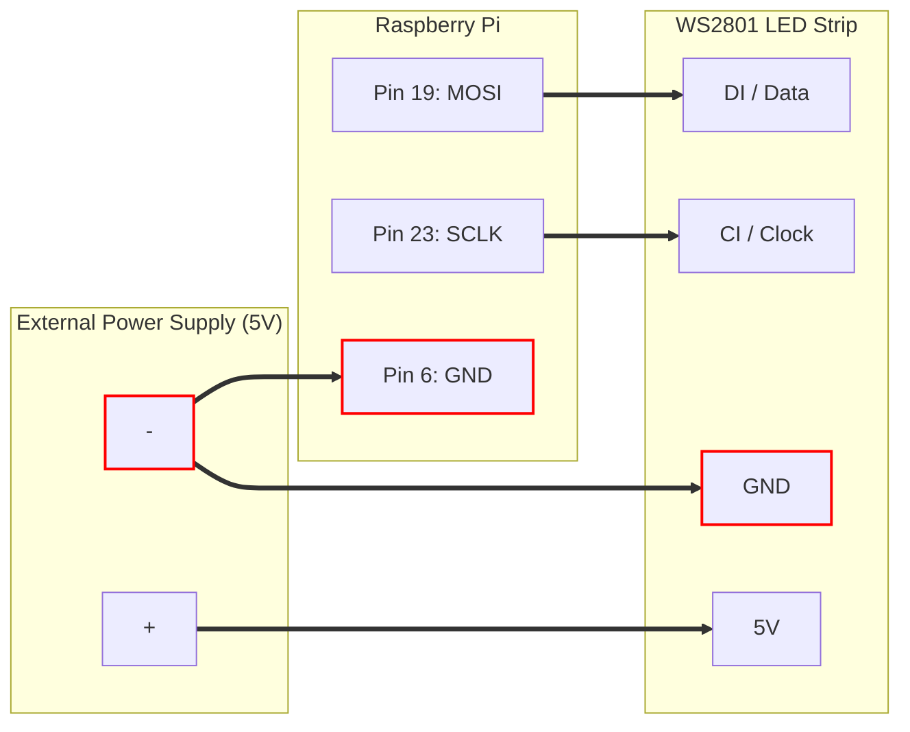
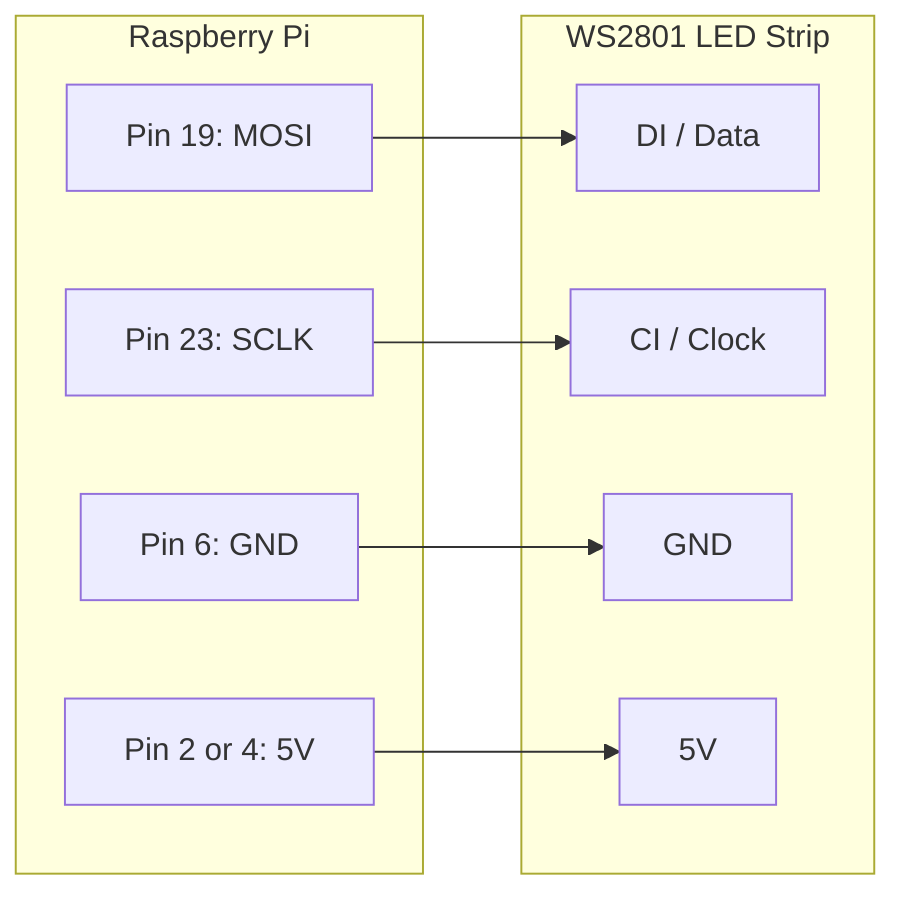

# Wiring Diagram / 接続図

This document outlines how to connect the WS2801 LED strip to the Raspberry Pi.
WS2801 LEDテープをRaspberry Piに接続する方法を説明します。

## Pinout / ピン配置

| Function | Raspberry Pi (Physical Pin) | WS2801 Strip |
| :--- | :--- | :--- |
| **Data (MOSI)** | **Pin 19** (GPIO 10) | **DI** (Data In) |
| **Clock (SCLK)** | **Pin 23** (GPIO 11) | **CI** (Clock In) |
| **Ground** | **Pin 6** (GND) | **GND** |
| **Power (5V)** | *External PSU (+)* OR *Pin 2/4* | **5V / VCC** |

## Layout for Tecthulhu Prime / 本プロジェクトのレイアウト

This project assumes a **9-LED setup**:
*   **Index 0**: Center Portal Core (Faction Color)
*   **Index 1-8**: Resonators R1 to R8

本プロジェクトは **9個のLED** 構成を想定しています：
*   **Index 0**: 中央のポータルコア（陣営色）
*   **Index 1-8**: レゾネータ R1 〜 R8

---

## Configuration A: External Power Supply (Recommended)
## 構成A: 外部電源を使用する場合（推奨）

For strips with more than 10-15 LEDs, using an external 5V power supply is strongly recommended.
LEDが10〜15個以上ある場合は、外部5V電源の使用を強く推奨します。

---

## Configuration B: Powered by Pi (Suitable for 9-LED Setup)
## 構成B: Piから給電する場合（9個構成に最適）

Since this project uses only 9 LEDs, it is generally safe to power the strip directly from the Raspberry Pi's 5V pins.
このプロジェクトではLEDを9個しか使用しないため、Raspberry Piの5Vピンから直接給電することが可能です。

**IMPORTANT**: You must connect the Power Supply GND to **BOTH** the LED Strip GND **AND** the Raspberry Pi GND (Common Ground).
**重要**: 電源のGND（マイナス）は、LEDテープのGND **かつ** Raspberry PiのGNDの両方に接続してください（共通グランド）。



### ASCII Diagram

```text
[ Raspberry Pi ]                  [ WS2801 LED Strip ]
|              |                  |                  |
|  Pin 19 ------------------------> DI (Data)        |
|  (MOSI)      |                  |                  |
|              |                  |                  |
|  Pin 23 ------------------------> CI (Clock)       |
|  (SCLK)      |                  |                  |
|              |                  |                  |
|  Pin 6  -----+                  |  5V (VCC) <-----------+
|  (GND)       |                  |                  |    |
|              |                  |  GND  <-----------+   |
+--------------+                  |                  |    |
               |                  +------------------+    |
               |                                          |
               |                                          |
      [ Common Ground connection ]                        |
               |                                          |
               |         [ External 5V Power Supply ]     |
               |         |                          |     |
               +---------| (-) GND          (+) 5V  |-----+
                         +--------------------------+
```

---

## Configuration B: Powered by Pi (Testing Only)
## 構成B: Piから給電する場合（テスト用のみ）

Use this ONLY for short strips (e.g., < 10 LEDs).
LEDが少ない（10個未満など）場合のみ使用してください。


